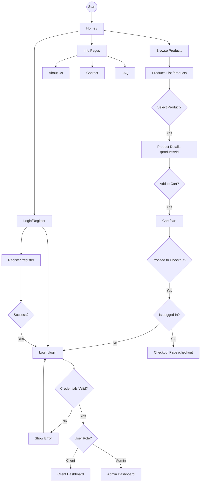
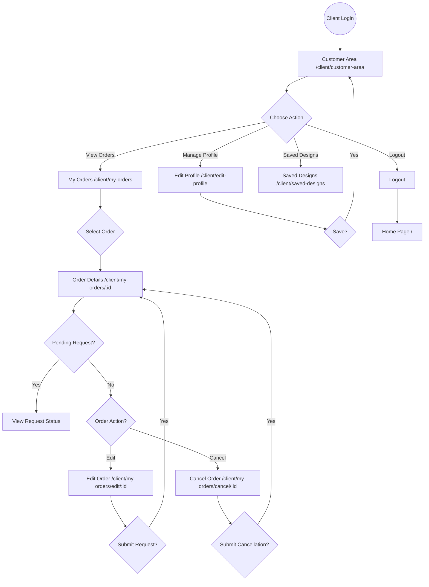
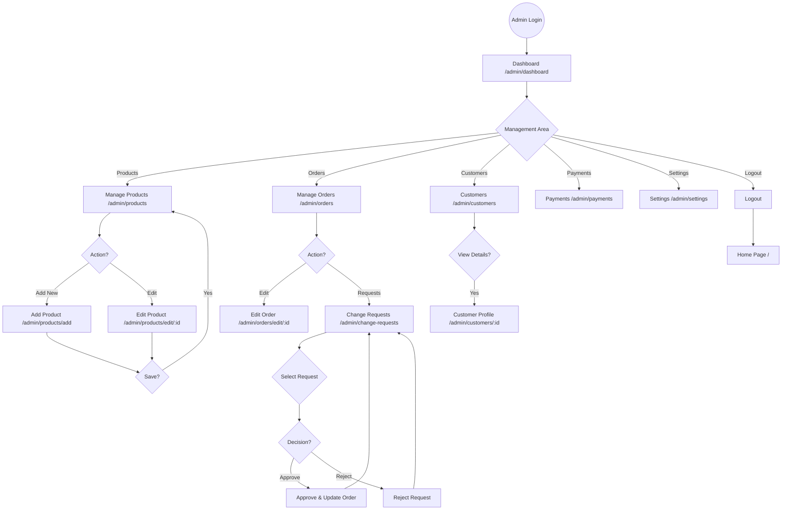

# Website Flowcharts

## Visitor Flow

```mermaid
flowchart TD
    Start((Start)) --> Home[Home /]
    
    %% Navigation
    Home --> NavProducts[Browse Products]
    Home --> NavAuth[Login/Register]
    Home --> NavInfo[Info Pages]

    %% Products Flow
    NavProducts --> Products[Products List /products]
    Products --> ClickProd{Select Product?}
    ClickProd -- Yes --> ProdDetails[Product Details /products/:id]
    ProdDetails --> AddCart{Add to Cart?}
    AddCart -- Yes --> Cart[Cart /cart]
    Cart --> Checkout{Proceed to Checkout?}
    Checkout -- Yes --> CheckAuth{Is Logged In?}
    
    %% Auth Check during checkout
    CheckAuth -- No --> Login[Login /login]
    CheckAuth -- Yes --> CheckoutPage[Checkout Page /checkout]
    
    %% Auth Flow
    NavAuth --> Login
    NavAuth --> Register[Register /register]
    Register --> RegSuccess{Success?}
    RegSuccess -- Yes --> Login
    
    Login --> CredsValid{Credentials Valid?}
    CredsValid -- No --> LoginError[Show Error]
    LoginError --> Login
    CredsValid -- Yes --> CheckRole{User Role?}
    
    %% Role Redirection
    CheckRole -- Client --> ClientArea[Client Dashboard]
    CheckRole -- Admin --> AdminDash[Admin Dashboard]

    %% Info Pages
    NavInfo --> About[About Us]
    NavInfo --> Contact[Contact]
    NavInfo --> FAQ[FAQ]
```

## Client Flow

```mermaid
flowchart TD
    Start((Client Login)) --> Dashboard[Customer Area /client/customer-area]
    
    Dashboard --> Actions{Choose Action}
    
    %% Orders
    %% Orders
    Actions -- View Orders --> MyOrders[My Orders /client/my-orders]
    MyOrders --> SelectOrder{Select Order}
    SelectOrder --> OrderDetails[Order Details /client/my-orders/:id]
    
    OrderDetails --> CheckPending{Pending Request?}
    CheckPending -- Yes --> ViewStatus[View Request Status]
    CheckPending -- No --> OrderActions{Order Action?}
    
    OrderActions -- Edit --> EditOrder[Edit Order /client/my-orders/edit/:id]
    OrderActions -- Cancel --> CancelOrder[Cancel Order /client/my-orders/cancel/:id]
    
    EditOrder --> SubmitReq{Submit Request?}
    SubmitReq -- Yes --> OrderDetails
    
    CancelOrder --> SubmitCancel{Submit Cancellation?}
    SubmitCancel -- Yes --> OrderDetails
    
    %% Profile
    Actions -- Manage Profile --> EditProfile[Edit Profile /client/edit-profile]
    EditProfile --> SaveProfile{Save?}
    SaveProfile -- Yes --> Dashboard
    
    Actions -- Saved Designs --> SavedDesigns[Saved Designs /client/saved-designs]
    
    %% Logout
    Actions -- Logout --> Logout[Logout]
    Logout --> Home[Home Page /]
```

## Admin Flow

```mermaid
flowchart TD
    Start((Admin Login)) --> Dashboard[Dashboard /admin/dashboard]
    
    Dashboard --> Manage{Management Area}
    
    %% Products
    Manage -- Products --> ProdList[Manage Products /admin/products]
    ProdList --> ProdAction{Action?}
    ProdAction -- Add New --> AddProd[Add Product /admin/products/add]
    ProdAction -- Edit --> EditProd[Edit Product /admin/products/edit/:id]
    AddProd --> SaveProd{Save?}
    EditProd --> SaveProd
    SaveProd -- Yes --> ProdList
    
    %% Orders
    Manage -- Orders --> OrderList[Manage Orders /admin/orders]
    OrderList --> OrderAction{Action?}
    OrderAction -- Edit --> EditOrder[Edit Order /admin/orders/edit/:id]
    OrderAction -- Requests --> ChangeReq[Change Requests /admin/change-requests]
    
    ChangeReq --> SelectReq{Select Request}
    SelectReq --> ReviewReq{Decision?}
    ReviewReq -- Approve --> ApproveAction[Approve & Update Order]
    ReviewReq -- Reject --> RejectAction[Reject Request]
    ApproveAction --> ChangeReq
    RejectAction --> ChangeReq
    
    %% Customers
    Manage -- Customers --> CustList[Customers /admin/customers]
    CustList --> ViewCust{View Details?}
    ViewCust -- Yes --> CustProfile[Customer Profile /admin/customers/:id]
    
    %% System
    Manage -- Payments --> Payments[Payments /admin/payments]
    Manage -- Settings --> Settings[Settings /admin/settings]
    
    %% Logout
    Manage -- Logout --> Logout[Logout]
    Logout --> Home[Home Page /]
```
