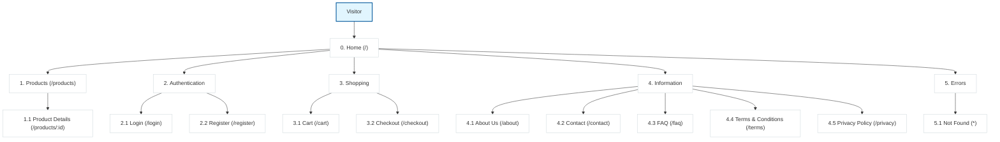
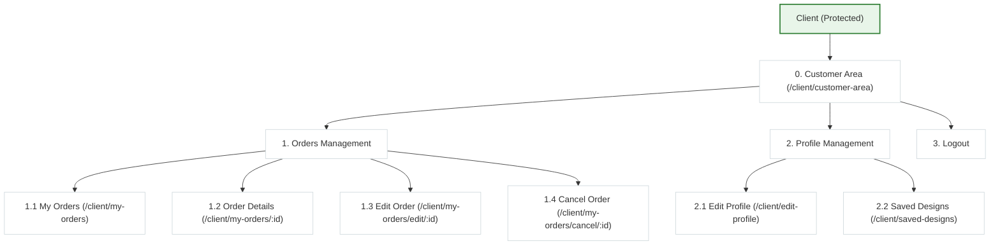

# Tree of Contents

## Visitor Map

```mermaid
graph TD
    Visitor[Visitor] --> Home["0. Home (/)"]
    
    %% Level 1
    Home --> Products["1. Products (/products)"]
    Home --> Auth["2. Authentication"]
    Home --> Shop["3. Shopping"]
    Home --> Info["4. Information"]
    Home --> Errors["5. Errors"]

    %% Level 2
    Products --> ProdDet["1.1 Product Details (/products/:id)"]
    
    Auth --> Login["2.1 Login (/login)"]
    Auth --> Register["2.2 Register (/register)"]
    
    Shop --> Cart["3.1 Cart (/cart)"]
    Shop --> Checkout["3.2 Checkout (/checkout)"]
    
    Info --> About["4.1 About Us (/about)"]
    Info --> Contact["4.2 Contact (/contact)"]
    Info --> FAQ["4.3 FAQ (/faq)"]
    Info --> Terms["4.4 Terms & Conditions (/terms)"]
    Info --> Privacy["4.5 Privacy Policy (/privacy)"]
    
    Errors --> NotFound["5.1 Not Found (*)"]

    %% Styling
    classDef root fill:#e1f5fe,stroke:#01579b,stroke-width:2px;
    classDef node fill:#ffffff,stroke:#cfd8dc,stroke-width:1px;
    class Visitor root;
    class Home,Products,Auth,Shop,Info,Errors,ProdDet,Login,Register,Cart,Checkout,About,Contact,FAQ,Terms,Privacy,NotFound node;
```

## Client Map

```mermaid
graph TD
    Client["Client (Protected)"] --> CustArea["0. Customer Area (/client/customer-area)"]
    
    %% Level 1
    CustArea --> Orders["1. Orders Management"]
    CustArea --> Profile["2. Profile Management"]
    CustArea --> Logout["3. Logout"]

    %% Level 2
    Orders --> MyOrders["1.1 My Orders (/client/my-orders)"]
    Orders --> OrderDet["1.2 Order Details (/client/my-orders/:id)"]
    Orders --> EditOrder["1.3 Edit Order (/client/my-orders/edit/:id)"]
    Orders --> CancelOrder["1.4 Cancel Order (/client/my-orders/cancel/:id)"]
    
    Profile --> EditProf["2.1 Edit Profile (/client/edit-profile)"]
    Profile --> SavedDes["2.2 Saved Designs (/client/saved-designs)"]

    %% Styling
    classDef root fill:#e8f5e9,stroke:#2e7d32,stroke-width:2px;
    classDef node fill:#ffffff,stroke:#cfd8dc,stroke-width:1px;
    class Client root;
    class CustArea,Orders,Profile,Logout,MyOrders,OrderDet,EditOrder,CancelOrder,EditProf,SavedDes node;
```

## Admin Map

```mermaid
graph TD
    Admin["Admin (Protected)"] --> Dash["0. Dashboard (/admin/dashboard)"]
    
    %% Level 1
    Dash --> Catalog["1. Catalog Management"]
    Dash --> OrderMgmt["2. Order Management"]
    Dash --> UserMgmt["3. User Management"]
    Dash --> Finance["4. Financials"]
    Dash --> System["5. System"]
    Dash --> Logout["6. Logout"]

    %% Level 2
    Catalog --> MngProd["1.1 Manage Products (/admin/products)"]
    Catalog --> AddProd["1.2 Add Product (/admin/products/add)"]
    Catalog --> EditProd["1.3 Edit Product (/admin/products/edit/:id)"]
    
    OrderMgmt --> MngOrders["2.1 Manage Orders (/admin/orders)"]
    OrderMgmt --> EditOrderAdm["2.2 Edit Order (/admin/orders/edit/:id)"]
    OrderMgmt --> ChangeReq["2.3 Change Requests (/admin/change-requests)"]
    
    UserMgmt --> CustList["3.1 Customers List (/admin/customers)"]
    UserMgmt --> CustProf["3.2 Customer Profile (/admin/customers/:id)"]
    
    Finance --> Payments["4.1 Payments (/admin/payments)"]
    
    System --> Settings["5.1 Settings (/admin/settings)"]

    %% Styling
    classDef root fill:#fff3e0,stroke:#ef6c00,stroke-width:2px;
    classDef node fill:#ffffff,stroke:#cfd8dc,stroke-width:1px;
    class Admin root;
    class Dash,Catalog,OrderMgmt,UserMgmt,Finance,System,Logout,MngProd,AddProd,EditProd,MngOrders,EditOrderAdm,ChangeReq,CustList,CustProf,Payments,Settings node;
```
